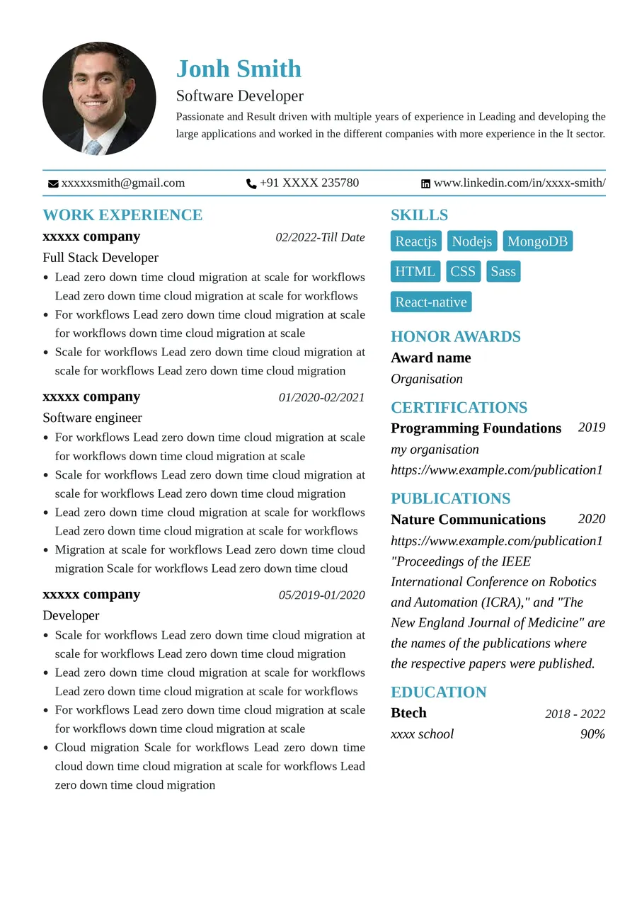

<div align="center">

# Resume Builder

**Build, edit and download a professional PDF resume — right in your browser.**
No sign-up. No backend. No lock-in.

[](https://createresume.in)
[](https://github.com/SasiVeeramachaneni/resume)

<br />



<br />

### Built with

[](https://reactrouter.com)
[](https://react.dev)
[](https://vite.dev)
[](https://mantine.dev)
[](https://www.typescriptlang.org)

</div>

> A plain **Vite single-page app** whose routes live in [`app/router.tsx`](app/router.tsx)
> and are rendered client-side with **React Router 7**. No Next.js runtime, no
> server-side rendering — just a static site that deploys anywhere.

---

## ✨ Capabilities

- **Live WYSIWYG editor** at `/resume` — type and watch it update instantly.
- **Two pluggable templates** — `professional` (two-column) and `classic`
  (single-column). Each is a self-contained folder, so adding one is a drop-in.
- **Full section set** — personal info, work experience, skills, certifications,
  awards, education, languages, patents, projects.
- **Image upload** and a **dark / light theme** toggle.
- **One-click PDF export** via `@react-pdf/renderer`.
- **LinkedIn import** — pull your logged-in LinkedIn profile straight into the
  form (dev-only, via Chrome DevTools Protocol; see
  [LinkedIn import](#-linkedin-import)).

## 🚀 Set up locally

> Prereqs: **Node 18+** and **npm 9+**. Optional: Google Chrome for the
> LinkedIn import. No Docker, no database, everything runs from the repo.

```bash
git clone https://github.com/SasiVeeramachaneni/resume.git
cd resume
npm install
npm run dev          # open the printed URL, then visit /resume
```

That's it. Visit <http://localhost:5173/resume>, fill in the form, pick a
template, and hit **Download** for a polished PDF.

Optional:

```bash
npm run build       # static production build into dist/
npm run preview     # serve the production build
npm run docs        # render this README as a Docsify site at :5174/docs.html
```

### npm scripts

| Script                | What it does                                 |
| --------------------- | -------------------------------------------- |
| `dev`                 | Start the dev server (includes LinkedIn CDP) |
| `build`               | Production build (also regenerates sitemap)  |
| `preview`             | Preview the production build                 |
| `typecheck`           | `tsc --noEmit`                               |
| `jest` / `jest:watch` | Run tests                                    |
| `prettier:write`      | Format the codebase                          |
| `docs`                | Serve README as a Docsify site               |
| `storybook`           | Storybook dev server                         |

## 🛠️ How it's built

- **Routing:** [React Router 7](https://reactrouter.com) via `react-router-dom`,
  declared in [`app/router.tsx`](app/router.tsx) and rendered through
  `RouterProvider` in [`main.tsx`](main.tsx). Client-side only — no SSR.
- **Build tool:** [Vite 8](https://vite.dev) for the dev server, HMR and the
  production bundle.
- **UI:** [Mantine 9](https://mantine.dev) components + the custom theme in
  [`theme.ts`](theme.ts), with CSS Modules per component.
- **Language:** [TypeScript 6](https://www.typescriptlang.org), strict mode.
- **PDF:** [`@react-pdf/renderer`](https://react-pdf.org/) renders the same data
  tree that powers the on-screen template to a downloadable PDF.
- **Rich text:** [Tiptap](https://tiptap.dev) powers the WYSIWYG section editors.
- **Templates:** each lives in `templates/<name>/` and exposes a
  `TemplateDescriptor` (metadata, sides, preview swatch, Layout). The resume
  page, the picker in the header and the PDF download all read from
  [`templates/registry.ts`](templates/registry.ts), so dropping a new folder in
  is enough.

## 🔗 LinkedIn import (optional, dev-only)

On `/resume`, next to **Settings**, the **Connect with LinkedIn** button imports
the _currently logged-in_ LinkedIn user's profile (name, headline, about,
experience, education, skills, certifications, awards, projects) into the form —
empty fields only, your existing data is preserved.

It works by attaching to an **already-running Chrome** over the Chrome DevTools
Protocol (CDP) and reading the page you're signed into. No OAuth, no API keys,
no LinkedIn Developer App — the scraper only ever sees _your_ session.

### One-time setup

1. Start Chrome with remote debugging, signed into LinkedIn:

   ```bash
   # macOS
   open -na "Google Chrome" --args --remote-debugging-port=9222
   # Linux
   google-chrome --remote-debugging-port=9222
   # Windows (cmd)
   start chrome --remote-debugging-port=9222
   ```

   > Tip: use a throwaway profile dir to keep your normal Chrome clean, e.g. on
   > macOS append `--user-data-dir=/tmp/li-chrome` and sign in once there.

2. Sign in to <https://www.linkedin.com> in that Chrome window.
3. Run `npm run dev`, open `/resume`, click **Connect with LinkedIn**.

### Configuration (all optional)

| Variable                  | Default                          | Description                                 |
| ------------------------- | -------------------------------- | ------------------------------------------- |
| `LINKEDIN_CDP_URL`        | `http://127.0.0.1:9222`          | Chrome DevTools endpoint                    |
| `LINKEDIN_PROFILE_URL`    | `https://www.linkedin.com/in/me` | Profile URL (redirects to your own profile) |
| `LINKEDIN_RENDER_TIMEOUT` | `45000`                          | Render wait, in ms                          |

Pop them in `.env.local` (already git-ignored) if you need non-defaults.

### Drive it with an MCP client (e.g. opencode)

The same scrape is also wrapped as an **MCP server** in
[`scripts/linkedin-mcp-server.mjs`](scripts/linkedin-mcp-server.mjs), exposing
the `linkedin_import_profile` tool. [`opencode.json`](opencode.json) wires it
up for [opencode](https://opencode.ai):

```json
{
  "$schema": "https://opencode.ai/config.json",
  "mcp": {
    "linkedin": {
      "type": "local",
      "command": ["node", "scripts/linkedin-mcp-server.mjs"],
      "enabled": true,
      "env": {
        "LINKEDIN_CDP_URL": "http://127.0.0.1:9222",
        "LINKEDIN_PROFILE_URL": "https://www.linkedin.com/in/me",
        "LINKEDIN_RENDER_TIMEOUT": "45000"
      }
    }
  }
}
```

Start Chrome with `--remote-debugging-port=9222` (signed in to LinkedIn), then
**(re)start opencode** in this repo — it reads `opencode.json` at startup and
spawns the stdio MCP server. (opencode does not hot-reload config; quit and
restart after editing it.)

Other MCP clients (Claude Desktop, etc.) can point at the same command —
`node scripts/linkedin-mcp-server.mjs` — over the stdio transport. The tool
returns `{ "ok": true, "resumeData": { ... } }`; pass `"includeRaw": true` for
the raw scraped profile.

### Troubleshooting

- **Redirect to sign-in / blank profile** — Chrome isn't signed into LinkedIn.
  Sign in in the `--remote-debugging-port=9222` Chrome and retry.
- **"Connection refused"** — Chrome wasn't started with the debugging flag (or
  `LINKEDIN_CDP_URL` is wrong). Restart Chrome with the flag.
- **Only name + headline, missing sections** — LinkedIn rendered lazily; either
  retry or raise `LINKEDIN_RENDER_TIMEOUT` (e.g. `60000`).
- **`puppeteer-core is not installed`** — run `npm install`.
- **`LinkedIn import is only available during local development`** — you're on a
  production build; the bridge is dev-only by design.

## 🔒 Privacy & security

- The LinkedIn bridge runs entirely on your machine during `npm run dev`. No
  profile data leaves your Chrome → your browser.
- The bridge is **never** bundled into the production build, so anyone deploying
  this gets a static site with no LinkedIn backend — the Connect button simply
  shows a "dev-only" message.
- The scraper only operates on the LinkedIn session _you_ are logged into; it
  cannot scrape arbitrary profiles.

## 🗂️ Project layout

```
app/                  routes & shared app code (app/router.tsx drives routing)
  resume/page.tsx     /resume builder page (template-agnostic; renders via registry)
components/           ResumeHeader, LinkedInImport, HeroBullets, Settings, ...
templates/            one folder per template — drop a new one in to add a layout
  registry.ts         allTemplates array + getTemplate(value) + templateOptions
  professional/       two-column layout
  classic/            single-column layout
hooks/useLinkedInImport.ts   calls the dev bridge, merges into ResumeContext
config.ts             shared constants (GITHUB_REPO_URL, etc.)
scripts/              linkedin-dev-plugin.mjs, linkedin-cdp-scrape.mjs,
                      linkedin-mapper.mjs, linkedin-mcp-server.mjs
```

### Adding a template

1. Create `templates/<your-template>/` with a `<YourTemplate>Layout.tsx`
   (implements `TemplateLayoutProps`, wraps each section with `wrapSection`),
   a `preview.module.css` (`.preview` / `.mobilePreview` swatches), and an
   `index.ts` exporting a `TemplateDescriptor`.
2. Add it to `allTemplates` in [`templates/registry.ts`](templates/registry.ts).
3. Optionally widen `TemplateValue` in [`templates/types.ts`](templates/types.ts)
   and the `settings.template` union in `components/declarations/types.ts`.

The resume page, the template picker in the header, and the PDF download pick it
up automatically.

## 📄 Licence

See [LICENCE](./LICENCE).
